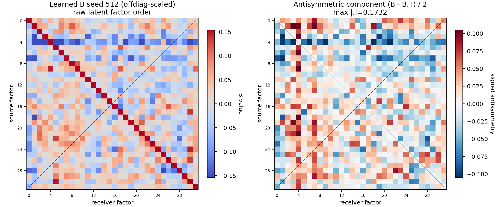
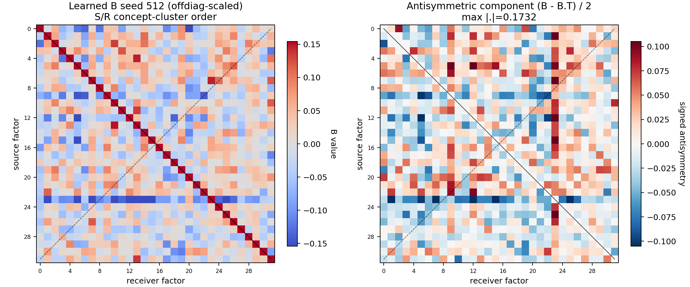

# FDG Skip32 Recent B Heatmap Report

Main checkpoint: `fdg_skip32_csi300_recent_seed512.pt`

Top10 seeds used for B/asymmetry data:
`512, 23, 37, 5, 40, 55, 25, 49, 17, 79`

## Figures

Raw latent factor order:

S/R concept-cluster order:

The left panel is learned `B`. It is off-diagonal scaled so the non-diagonal
blocks remain visible while the diagonal saturates. The right panel is
`(B - B.T) / 2`.

## Seed512 Asymmetry

| metric | value |
| --- | ---: |
| `||B||_F` | 5.885291 |
| `||anti(B)||_F / ||B||_F` | 0.202404 |
| `max abs anti(B)` | 0.173208 |
| `mean abs anti(B)` upper triangle | 0.028713 |
| diagonal abs mean | 0.997178 |
| anti-diagonal abs mean | 0.033624 |

## Top10 Summary

| metric | mean | std |
| --- | ---: | ---: |
| `||anti(B)||_F / ||B||_F` | 0.142557 | 0.026884 |
| `max abs anti(B)` | 0.094947 | 0.032418 |
| `mean abs anti(B)` upper triangle | 0.020929 | 0.003734 |
| diagonal abs mean | 1.009910 | 0.005284 |
| anti-diagonal abs mean | 0.028681 | 0.002702 |

## Seed512 Largest Asymmetric Pairs

| source | receiver | `B_ij` | `B_ji` | `(B_ij-B_ji)/2` |
| ---: | ---: | ---: | ---: | ---: |
| 4 | 9 | -0.200657 | 0.145759 | -0.173208 |
| 4 | 6 | -0.261399 | 0.019694 | -0.140546 |
| 4 | 21 | -0.259754 | 0.012891 | -0.136322 |
| 3 | 4 | 0.045036 | -0.217625 | 0.131331 |
| 4 | 18 | -0.153517 | 0.066553 | -0.110035 |
| 1 | 3 | 0.056155 | -0.153980 | 0.105067 |
| 1 | 7 | 0.057690 | -0.147213 | 0.102451 |
| 1 | 4 | -0.011884 | -0.212224 | 0.100170 |
| 3 | 19 | -0.108553 | 0.087675 | -0.098114 |
| 7 | 19 | -0.142206 | 0.041348 | -0.091777 |

## Data Files

- `fdg_skip32_recent_top10_B_matrices.npz`: raw B matrices for all top10 seeds.
- `fdg_skip32_recent_top10_B_asymmetry_summary.csv`: top10 per-seed asymmetry stats.
- `fdg_skip32_recent_top10_top_asym_pairs.csv`: top asymmetric pairs per seed.
- `fdg_skip32_recent_seed512_B_raw_order.csv`: seed512 raw B.
- `fdg_skip32_recent_seed512_B_antisym_raw_order.csv`: seed512 raw `(B-B.T)/2`.
- `fdg_skip32_recent_seed512_B_sr_concept_cluster_order.csv`: seed512 B after S/R concept-cluster order.
- `fdg_skip32_recent_seed512_B_antisym_sr_concept_cluster_order.csv`: seed512 antisymmetric matrix after the same order.
- `fdg_skip32_recent_seed512_source_S_stock_exposure.csv`: average test-set S exposure per stock.
- `fdg_skip32_recent_seed512_receiver_R_stock_exposure.csv`: average test-set R exposure per stock.
- `fdg_skip32_recent_seed512_factor_order.csv`: factor order used by the clustered figure.
- `fdg_skip32_recent_seed512_factor_semantics_top_stocks.csv`: top source/receiver stocks per latent factor.

Ordering note: the clustered order uses average test-set S/R stock exposure,
mapped through HIST `stock2concept` as a concept proxy. In this local data,
656 of 672 test instruments match the HIST concept map after code normalization.
